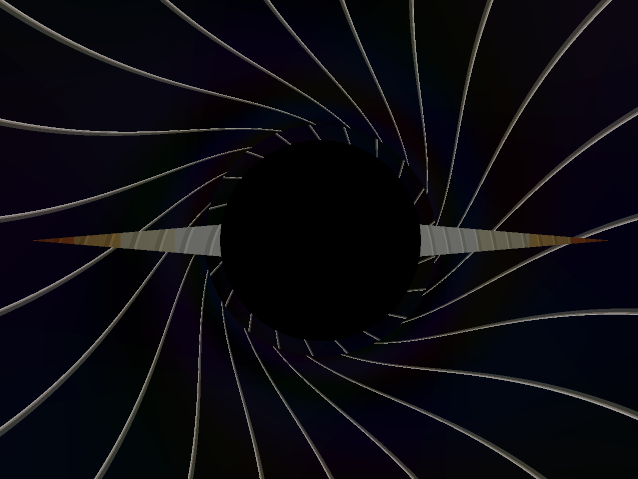

# BH Ray Tracer Project

A CPU-based ray tracer implementation showcasing 3D rendering techniques and mathematical algorithms, rendering an image of a blackhole.

## Current Features
- Ray-sphere intersection
- Approximated geodesic Schwarzchild black hole visualization with accretion disk and photon sphere
- OpenGL display integration
- Pixel processing using numba
- Real-time rendering

## Planned Features
- [ ] Add proper geodesic solving, handling complex orbits and multiple disk crosses
- [ ] Advanced effects (lensing, Kerr black hole, multiple disk components)
- [ ] Implement interactive controls
- [ ] Performance optimizations
- [ ] GPU acceleration

## Requirements
- Python 3.x
- PyOpenGL
- GLFW
- NumPy
- Numba

## Installation
```bash
pip install -r requirements.txt 
```

## Usage
```bash
python rt_blackhole_project.py 
```
This will open a window displaying the black hole visualization. Close the window to exit.

## Sample Output

